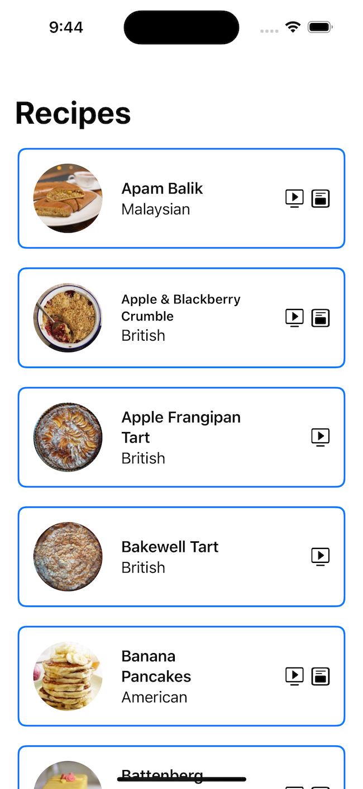

# Steps to Run the App

1. Open the `FetchRecipes.xcodeproj` file in Xcode.
2. Select either a simulator or device to run the app on.
3. Click the play button in the top toolbar or `Cmd-R` on the keyboard to run the application.

**Notes on usage:**
The recipes can be refreshed using a ‘pull-to-refresh’ action on the list of recipes.  The same refresh action applies to the empty state.  The error overlay includes a button to refresh, no pull-to-refresh required there.

# Focus Areas: What specific areas of the project did you prioritize? Why did you choose to focus on these areas?

I prioritized the Repository and DataSource classes.  These classes provide the data and core functionality of the application.  This is where the business logic lives, and so provides the highest risk if not implemented correctly.

# Time Spent: Approximately how long did you spend working on this project? How did you allocate your time?

I spent approximately 5 hours total on this project.  I didn’t have a set schedule or limit for any particular section or feature.  I worked until the application reached a state that I was happy with, both in functionality and in code cleanliness.

# Trade-offs and Decisions: Did you make any significant trade-offs in your approach?

I spent the most time on the business logic, which is where you will find that the unit tests focus as well.  The UI of the application can always be updated at a later date.  I have no sense of style and am not a good visual designer, but I am good at the functional aspects of development so I put more emphasis there.

# Weakest Part of the Project: What do you think is the weakest part of your project?

I could have implemented a better dependency injection system.  Right now the injection is handled using default values for constructor parameters.  This makes them easy to use, and easy to test, but isn’t really scalable.  I also could have spent more time moving the `RecipesViewModel` to an environment object in the `FetchRecipesApp` class.  Even though the view model is a `@StateObject` in the `RecipesView`, which guarantees that only one instance is maintained for the life of the view, having it as an environment object would have provided an extra level of certainty.  I also could have added a view for the `.loading` state.

# External Code and Dependencies: Did you use any external code, libraries, or dependencies?

Yes, I brought in the `Nuke` image caching framework.  It has a sub-framework called `NukeUI` which contains a `LazyImage` ui component.  This has advantages over the `AsyncImage` native class, providing more refined control of the image caching as well as some custom features for placeholders and error states.

# Additional Information: Is there anything else we should know? Feel free to share any insights or constraints you encountered.

I used SwiftTesting for the first time in this application.  It seemed like a good opportunity to explore the new framework.  I find it very easy to use and has many powerful features I have yet to fully explore. 

I’ve included screenshots of the three main application states, see below.

# Steps to Run the App

1. Open the `FetchRecipes.xcodeproj` file in Xcode.
2. Select either a simulator or device to run the app on.
3. Click the play button in the top toolbar or `Cmd-R` on the keyboard to run the application.

**Notes on usage:**
The recipes can be refreshed using a ‘pull-to-refresh’ action on the list of recipes.  The same refresh action applies to the empty state.  The error overlay includes a button to refresh, no pull-to-refresh required there.

# Focus Areas: What specific areas of the project did you prioritize? Why did you choose to focus on these areas?

I prioritized the Repository and DataSource classes.  These classes provide the data and core functionality of the application.  This is where the business logic lives, and so provides the highest risk if not implemented correctly.

# Time Spent: Approximately how long did you spend working on this project? How did you allocate your time?

I spent approximately 5 hours total on this project.  I didn’t have a set schedule or limit for any particular section or feature.  I worked until the application reached a state that I was happy with, both in functionality and in code cleanliness.

# Trade-offs and Decisions: Did you make any significant trade-offs in your approach?

I spent the most time on the business logic, which is where you will find that the unit tests focus as well.  The UI of the application can always be updated at a later date.  I have no sense of style and am not a good visual designer, but I am good at the functional aspects of development so I put more emphasis there.

# Weakest Part of the Project: What do you think is the weakest part of your project?

I could have implemented a better dependency injection system.  Right now the injection is handled using default values for constructor parameters.  This makes them easy to use, and easy to test, but isn’t really scalable.  I also could have spent more time moving the `RecipesViewModel` to an environment object in the `FetchRecipesApp` class.  Even though the view model is a `@StateObject` in the `RecipesView`, which guarantees that only one instance is maintained for the life of the view, having it as an environment object would have provided an extra level of certainty.  I also could have added a view for the `.loading` state.

# External Code and Dependencies: Did you use any external code, libraries, or dependencies?

Yes, I brought in the `Nuke` image caching framework.  It has a sub-framework called `NukeUI` which contains a `LazyImage` ui component.  This has advantages over the `AsyncImage` native class, providing more refined control of the image caching as well as some custom features for placeholders and error states.

# Additional Information: Is there anything else we should know? Feel free to share any insights or constraints you encountered.

I used SwiftTesting for the first time in this application.  It seemed like a good opportunity to explore the new framework.  I find it very easy to use and has many powerful features I have yet to fully explore. 

I’ve included screenshots of the three main application states, see below.

